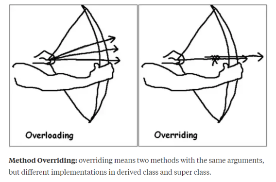

# 유니티 사용법
## 유니티 화면 구경하기
1. scene 화면
- 오브젝트를 확인하고 조작합니다
2. game 화면
- 제작한 콘텐츠의 결과물을 게임상에서 미리 볼 수 있습니다
3. hierarchy 창
- 씬 화면에 있는 오브젝트의 계층ㄷ 구조를 목록 형식으로 확인
4. project 창
- 콘텐츠 제작에 필요한 소스를 디렉터리 형식으로 관리
5. inspector 창
- 오브젝트가 갖는 컴포넌트와 컴포넌트의 속성을 확인한다
- 컴포넌트 == 프로그래밍이나 소프트웨어 개발에서 재사용 가능한 독립적인 단위
6. play 버튼
- 플레이 모드와 편집 모드를 전환한다
7. pause 버튼
- 플레이 모드에서 실행을 일시정지 한다
8. step 버튼
- 플레이 모드로 실행하는 도중 프레임 단위로 이동
## 오브젝트 조작하기
1. view툴(v키)
- 오브젝트를 조작하지 않고 시야 조절
2. move 툴(w키)
- 오브젝트 위치 조절
3. rotate 툴(e키)
4. scale 툴(r키)
- 크기 조절
5. rect 풀(t키)
- 오브젝트의 너비와 높이 조절
6. transform 툴 (y키)
---
# 자료형
## float 
- 소수전 뒤에 'f'를 붙여야 하는 이유는 안 붙이면 다 double 자료형으로 인식하기 때문이다
## bool과 비교 연산자
- c#에서는 비교연산자를 한번에 사용이 불가능하다
```
1<3<5
```
이게 
```
true < 5
```
이렇게 왼쪽 것이 인식이 되고 그 다음에 진행을 한다
## 함수
- c#에서는 함수명이 같아도 매개변수와 반환값의 방식이 다르면 서로 다른 것이라고 인식을 하는 것 같다
## void
- 이거는 함수의 반환 값이 없다는 의미이다
- 여기서 return을 하면 오류가 생긴다
---
# 객체 지향
## 객체란?
- 데이터와 그 데티어에 관련된 동작을 모두 포함한 개념
- 프로그래밍에서는 한가지 더 있는데 그거는 데이터의 분산을 막기 위해 속성과 기능을 하나로 묶은 그룹
## 객체 지향 언어의 장점
- 어디에 오류가 생기면 전체를 바꾸지 않고 부분만 즉 일부의 객체만 수정을 가지면 된다
## 객체 지향 언어의 특징
1. 캡슐화(encapsulation)
- 내용물을 잠아 새어나가지 않게 보호
- 외부에서 못보게 보호를 하고 원하는 속성만 공유
2. 상속성(inheritance)
- 자식이 부모의 속성을 가져온다. 굳이 코드를 여러번 쓸 이유가 없다
3. 다형성(poltmophism)
- 기본적인 형태는 같지만 상황에 따라 다른 특징을 갖게 되는 것
---
#### 다형성의 예시
1. 오버로드(overload)
- 부모의 속성을 그대로 받아서 쓰는 방식
2. 오버라이드(override)
- 부모의 것을 가져오지만 자식에서 다시 재정의 하여 쓰는 방식

---
4. 추상화(abstraction)
- 공통적인 것을 남기고 다른 것을 버리는 것. 그니까 단거리 공격,장거리 공격,맨손 공격 이런 것들을 하나의 "공격"으로 묶는 방식
# 배열과 리스트의 차이
- 배열 == 크기를 지정한다
- 리스트 == 크기를 지정하지 않는다
---
# 컴포넌트
- 컴포넌트 == 코드가 적힌 스크립트 
- 스크립트 == 클래스가 존재
## MonoBehaviour
- 우리는 기본적으로 스크립트를 만들떄 이것에 상속을 받는데. 이거는 기본 함수를 쓸 수 있게 해주는 역활을 한다.
## 컴포넌트 사용
- 컴포넌트 안에 있는게 속성이자 기능이다
---
# 컴포넌트 가져오기 - 인스펙터창에서 직접 할당
- 그냥 드래그를 하는 방식
- 그니까 사람이 인위적으로 넣는 방식
# 컴포넌트 가져오기 - GetComponent<T>()
- 이거를 약간 설명을 하자면 T는 transform 이라는 자료형이다
- 그니까 내가 지정한 것의 tranform 컴포넌트를 가진다라는 의미이다
- GetComponent<Transform>() == transform // transform 은 MonoBehaviour에서 제공해준 것
# 컴포넌트 가져오기 - 검색
1. 이름 검색 - Find()
2. 태그 검색 - FindGame ObjectWithTag()
3. 컴포넌트 검색 - FindObjectOfType<T>()
---
# start() 함수
- 이 함수는 시작 할때 단 한번 시행이 되며 변수들을 초기화 한다
# Trasform  컴포넌트
### 주요 속성
1. position
2. rotation
3. scale
### 핵심 역활
1. 공간 정보 정의 
- 이놈이 뭐하는 건지 알려줌
2. 부모-자식 관계 형성
- 부모에 대한 자식의 상대적 위치 이런 것들이 가능해짐
# GameObject  
- 이 자체로는 아무런 기능이 없다(빈 컨테이너, 뼈대)
### 게임 오브젝트와 컴포넌트
- 게임 오브젝트 == 기능을 담는 그릇이나 뼈대(cube 이런거)
- 컴포넌트 == 게임 오브젝트에 붙어서 실제 기능을 수행하는 부품들
#### 참조
- 모든 코드가 있는 스크립트가 컴포넌트가 아니라 컴포넌트 안에 스크립트가 있는 방식이다
- 컴포넌트 > 스크립트