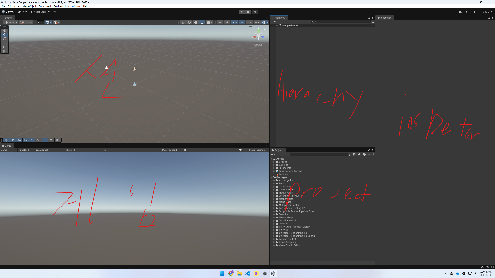

# 1.1 개발 방법론
## 1.1-1 프로잭트 제작의 이해
1. 제안 기획
- 개발 진행 여부 검토
2. 프로토타이핑
- 제안 기획 내용 검증
3. 프로잭트 착수
4. 개발
5. 알파
6. 베타
7. 결과물
### 과거와 달리 병렬 형태의 개선된 개발 방식
- 과거에는 순차적인 방식으로 기간에 따라 한쪽만 과부화되는 문제가 있었다

- 현재는 이렇게 병렬로 작업을 하여 한쪽이 과부화가 되고 개발비 증가를 방지한다
---
## 1.1-2 직군
### PD,Director,PM
- 콘텐츠의 전체 방향을 결정하는 역활.또는 인력분배, 개발 계획 수립,자금 및 수입관리 및 감독 등의 책임
- PM == 프로잭트의 일정과 팀원간의 의사결정 조율
### 기획
- 콘텐츠의 설계도를 만드는 사람
### 프로그램
- 기획의 결과물인 설계도와 아트의 결과물을 바탕으로 실제로 동작하는 콘텐츠를 구현하는 직군
### 아트
- 콘텐츠의 디자인 관련 요소를 만드는 직군
---
## 1.1-3 레고 조립식 유니티 제작 방법
### 오브잭트 제작
- 컴포넌트(Component)
### 씬 구성
- 게임오브잭트(game object)
### 프로잭트 구성
- 여러개 씬의 합
- 씬은 여러개의 컴포너트로 구성
### 프로토타입
- 일단 기볹거으로 대충 만드는 것 -> 구현 가능한지 확인
## 1.1-3 유니티 화면 구성
### 새로운 프로잭트 생성하기
- 탬플릿의 종류
1. 2D == 유니티의 내장 파이프라인을 사용하는 2D 프로잭트용 템플릿
2. 3D == 유니티의 내장 파이프라인을 사용하는 3D 프로잭트용 템플릿
3. 3D with extras == 3D와 비슷하지만 포스트 프로세싱, 프리셋, 예시 콘텐츠 추가도 포함
4. High Defifition RP == 셰이더 모델 5.0(DX11이상)을 지원하는 플랫폼 -> 하이엔드 그래픽 구현
5. universal RP == 성능에 맞춰진 플랫폼. 조명을 사용,모바일 가능
### 화면 구성

1. 씬(scene) == 게임 오브젝트들을 비주얼적으로 확인하거나 조작할 수 있는 창
2. 하이어라키(hierarchy) 뷰 == 씬 뷰에서 보이는 게임 오브잭트들의 목록을 관리하는 창
3. 인스펙터(inspector) 뷰 == 게임 오브젝트가 어떠한 컴포넌트로 이루어져 있는지 확인하고 수정할 수 있는 창
4. 프로잭트(project) 뷰 == 콘텐츠 제작에 필요한 파일, 리소스 등을 관리하는 창
5. 게임(game) 뷰 == 제작하는 콘텐프를 실행했을때 보이는 창
### 단순키
- f == 내가 선택한 것을 보이게 함
- ctrl + d == 버텍스 스내핑(vertex snapping) == 복사
- v == 기모즈(gimoz) == 내가 원하는 꼭짓점으로 이동